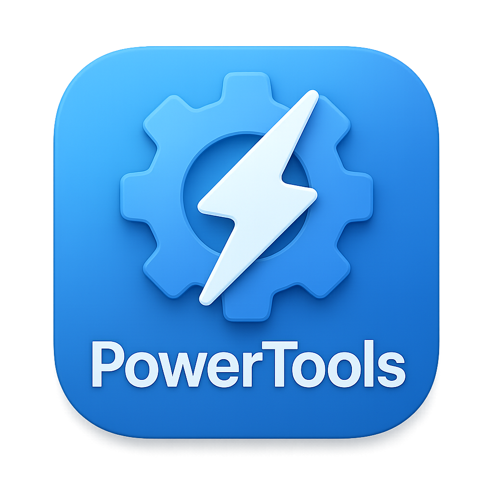
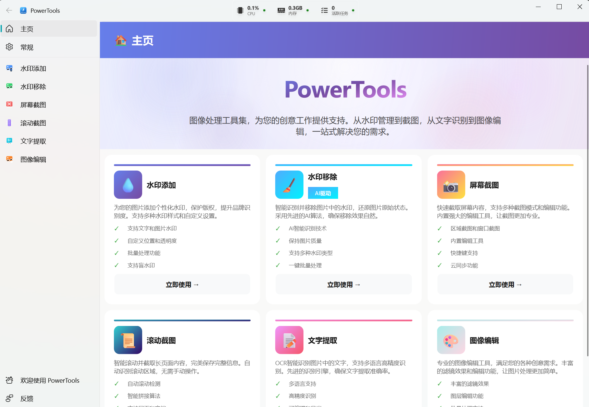
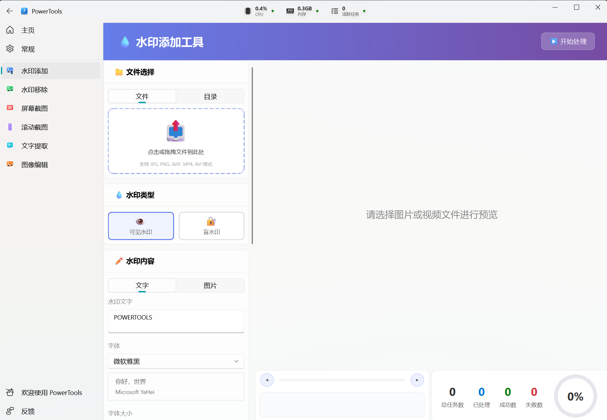
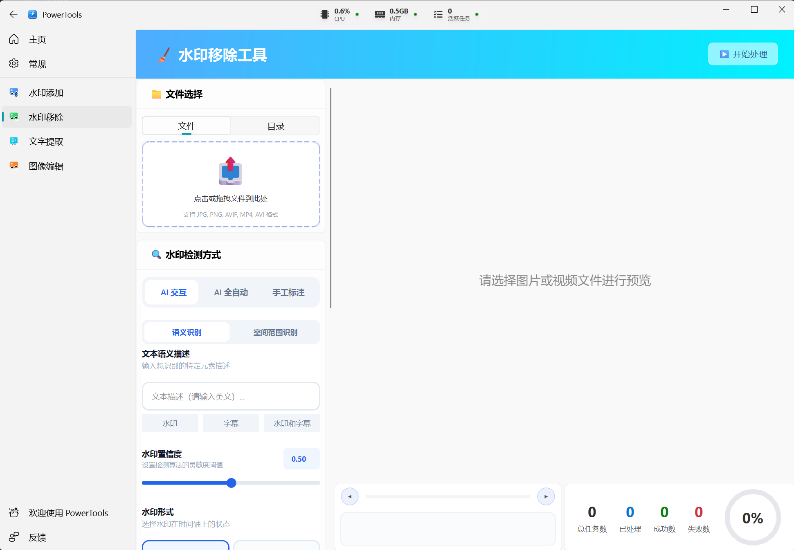
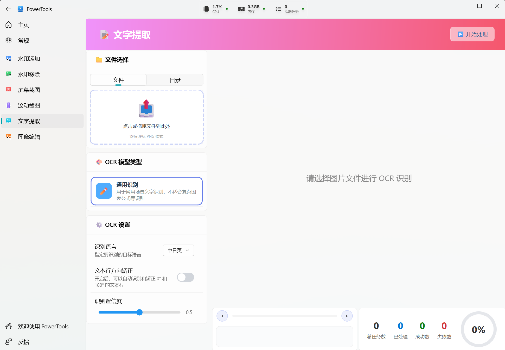
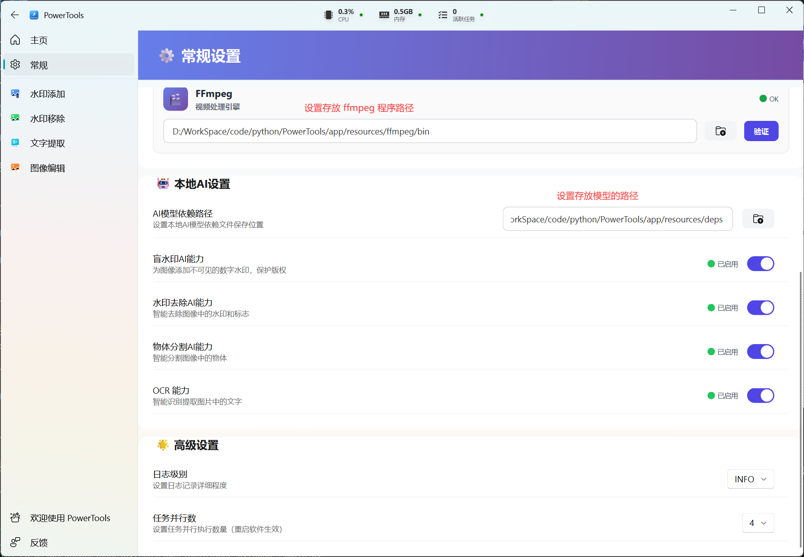
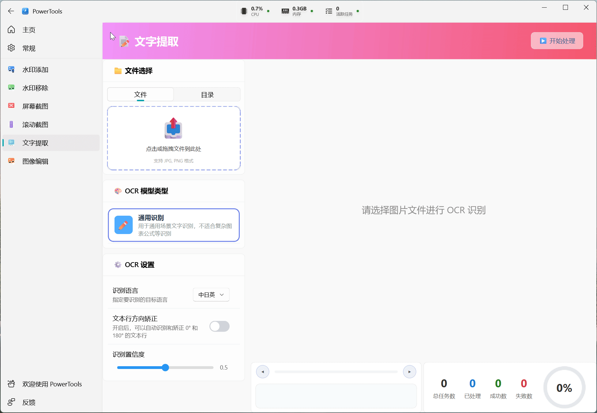

# PowerTools

<p align="center">
  
</p>

<p align="center">
  <strong>图像处理工具集</strong> · 水印 · 截图 · OCR · 图像编辑
</p>

<p align="center">
  为创意工作一站式解决图片相关需求，支持 Windows、macOS
</p>

---

## 界面预览

应用左侧导航切换功能，右侧为参数与预览区域。

| 主页 | 水印添加 | 水印移除 | OCR |
|------|----------|----------|----------|
| [](docs/screenshots/home.png) | [](docs/screenshots/watermark-add.png) | [](docs/screenshots/watermark-remove.png) | [](docs/screenshots/ocr.png) |

---

## 开发进度与更新计划
### 🛠 进行中
- **优化视频去水印效果**
- **视频支持字幕提取和去除**

### 📌 未来计划
- 支持 GPU 加速，提升处理速度

### ✅ 已完成
| 功能 | 状态 | 说明 |
|------|------|------|
| 水印添加 | ✅ 已完成 | 可见 + 盲水印，图片/视频，批量 |
| 水印移除 | ✅ 已完成 | AI 去水印，图片/视频，单文件与批量 |
| 文字提取(OCR) | ✅ 已完成 | 图片文字提取与识别，单文件与批量 |


## 安装

### 下载 Release 安装包（推荐）

在 [Releases](https://github.com/SmileSnail5470/PowerTools/releases) 页面提供各平台的安装包。

| 平台 | 说明 |
|------|------|
| **Windows** | 下载压缩包，解压，双击运行 |
| **macOS** | 下载压缩包，解压，双击运行 |

**步骤简述：**

1. 打开项目 [Releases](https://github.com/SmileSnail5470/PowerTools/releases) 页面  
2. 选择最新版本，下载与您系统对应的安装包  
3. 按上表完成安装或解压  
4. 在解压目录中，双击启动 PowerTools

下载 [`ffmpeg`程序](https://www.ffmpeg.org/download.html)，在软件的设置页面设置【ffmpeg路径】为`ffmpeg`可执行文件所在的路径目录。例如设置`../ffmpeg/bin` 路径。

**可选步骤（也可在设置页面开启对应功能，会自动下载模型文件，需要科学上网才可以下载）：**
- 下载 [OCR 模型](https://drive.google.com/file/d/1PNEJ8UXyqxEbwDDq2CpnU5lTa0bUUGgo/view?usp=sharing)
- 下载 [去水印模型](https://drive.google.com/file/d/1ulNiQo8G0XHiSP4gV7Hk-ng4XCJSvTlL/view?usp=sharing)
- 下载 [盲水印添加模型](https://drive.google.com/file/d/1HgJzhcWxvhy2_QhbVFow6Z84yTRftgzL/view?usp=sharing)

下载完解压后，启动软件，导航到设置界面，设置【AI模型依赖路径】为解压后的路径父目录。例如下面的 `../deps` 目录下的结构是
```bash
.
├── blind_watermark_addition
├── ocr
└── visible_watermark_removal
```


---

## 结果预览

### 水印添加

| 可见水印添加 | 盲水印添加提取 |
|------|----------|
| [](docs/results/visible-watermark-add.gif) | [](docs/screenshots/blind-watermark.gif) |

---

### 水印移除

| 可见水印移除 |
|------|
| [](docs/results/visible-watermark-remove.gif) |

---

### 文字提取（OCR）

| 文字提取 |
|------|
| [](docs/results/ocr.gif) |

---

## 反馈与许可

- 使用中如有问题或建议，欢迎通过仓库 **Issues** 或应用内「反馈」提交。

如果 PowerTools 对你有帮助，欢迎请我喝杯咖啡 ☕

<p align="center">
  
  &nbsp;&nbsp;&nbsp;
  
</p>

> 赞助将用于项目维护与功能迭代，完全自愿 ❤️

感谢使用 **PowerTools**。
